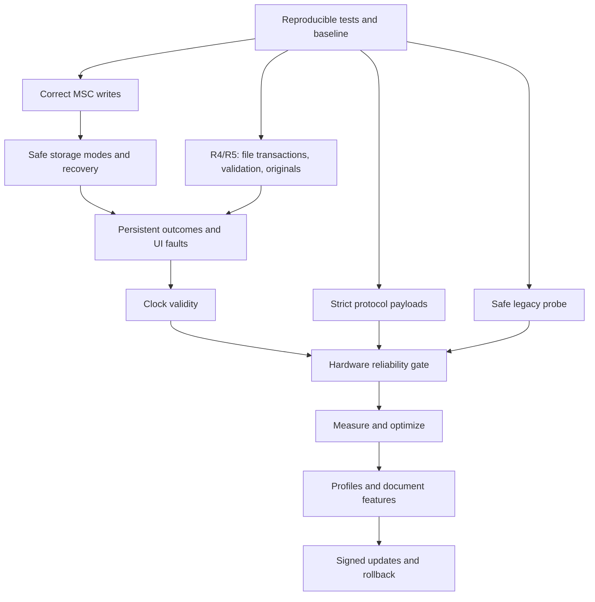

# Scanner gateway QA improvements implementation plan

> **For agentic workers:** REQUIRED SUB-SKILL: Use superpowers:subagent-driven-development or superpowers:executing-plans to implement this plan task-by-task. Steps use checkbox (`- [ ]`) syntax for tracking.

**Goal:** Resolve every recorded QA defect, improve measured speed and resource use, and add the proposed ESP-native scanner features in testable releases.

**Architecture:** Preserve exclusive SD ownership and a single application owner of scanner/UI state. Correct the MSC write contract first, preserve scan originals, then add bounded services for settings, documents, and firmware updates.

**Tech Stack:** ESP-IDF 5.5.5, ESP32-S3, TinyUSB 0.21.0~2, maintained esp_tinyusb 2.3.0 override, FatFs, ESC/I-2, ST7789, C, Python/ziglang/Pillow, PowerShell.

**Spec:** [QA improvements design](../specs/2026-09-19-qa-improvements-design.md), based on the [QA report](../../qa-review-2026-09-19.md).

## Global constraints

- Target the existing Waveshare ESP32-S3-LCD-1.47 and Epson ES-60W; verify the physical board revision before enabling new pins or PSRAM.
- Use ESP-IDF 5.5.5 and TinyUSB 0.21.0~2; maintain a checked-in, narrowly patched esp_tinyusb 2.3.0 override.
- Default scanning remains 300 dpi RGB, JPEG quality 75, with a 300-second display/LED timeout.
- Only one owner may access the SD filesystem; never format automatically or overwrite an existing scan or working file.
- Keep credentials and private firmware binaries out of Git, CI artifacts, logs, and published reports.
- Do not recreate GATEWAY.TXT or require a companion PC application.
- Use expendable media for write-fault and power-loss testing; the previously damaged card is excluded.

## Review focus

- A completed USB receive arriving around detach must not lose its accepted SD write: R2.
- A stale or rejected eject must not authorize APP access: R3.
- Dark page content must survive even when crop detection is wrong: R4/R5.
- Power failure between original, derivative, and PDF publication must retain completed pages: R4/F5.
- Unavailable time, scanner, or SD must leave a truthful, responsive state: R6/R7/F2.

## Read this plan in three parts

| Release | Detailed plan | Deliverable / gate |
|---|---|---|
| 1. Reliability | [Reliability tasks R1-R10](2026-09-19-reliability.md) | Correct USB writes and ownership, preserved originals, strict validation, useful recovery, trustworthy tests. Hardware gate R10 must pass. |
| 2. Performance | [Performance tasks P1-P8](2026-09-19-performance.md) | Benchmarked buffer/processing/power improvements and flash space for feature growth. No speed promise precedes measurement. |
| 3. Features | [Feature tasks F1-F8](2026-09-19-features.md) | Saved profiles/menu, card/time controls, receipts/naming, PDF batches, preview/orientation, and rollback-capable updates. Each feature has its own acceptance gate. |

## Proposed behavior worth reviewing

- Automatic scanning exposes read-only USB storage; a separate writable maintenance mode preserves the ability to manage SD files from Windows.
- A scan keeps `SCANnnnn.JPG` as the original; width cropping adds `CROPnnnn.JPG` instead of deleting the source.
- The first settings release supports verified 300/600 dpi and quality 50/75 combinations, with the current 300/75 profile selected by default.
- PDF generation, preview, and firmware updating follow the reliability release. OCR and cloud/PC services are not part of these releases.

Execution began on September 20, 2026, after the user instructed the agent to begin. Reliability work is isolated on `reliability/qa-2026-09-20`; the original checkout is preserved. The [acceptance record](../../qa/reliability-acceptance.md) tracks implementation evidence and the hardware gates. Performance and feature work remain dependent on R10 acceptance.

## Dependency order

R2/R3 and the combined R4/R5 unit can be developed independently against frozen interfaces. R4/R5 share one implementation/review gate: file primitives, validator, capture integration, then the joint tests/build. Integrate shared `main.c` changes sequentially. R8 and R9 are independent. Performance experiments can run in parallel only with separate firmware builds and exclusive access to the physical board.

## Coverage: all QA findings

| Finding | Planned owner |
|---|---|
| QA-01 discarded queued write; QA-02 hidden physical write failure | R2 |
| QA-03 forced removal of writable host volume | R3 |
| QA-04 content-destroying crop; QA-05 unvalidated JPEG rows | R5, with original preservation in R4 |
| QA-06 `.CRP` overwrite/deletion; QA-15 incorrect saved size | R4 |
| QA-07 lost outcomes/cleanup warning; QA-12 display/LED fault handling | R6 |
| QA-08 boot/fatal storage recovery | R3/R6 |
| QA-09 unknown timestamps | R7, expanded by F3 |
| QA-10 quality verifier; QA-11 clean-checkout tests | R1 |
| QA-13 embedded-NUL protocol payload | R8 |
| QA-14 legacy Wi-Fi probe | R9 |

## Coverage: optimizations and features

| Proposal from QA | Task |
|---|---|
| Per-stage timing/heap metrics | P1 |
| Larger MSC buffers | P3 |
| Combine JPEG passes; size allocations to input | R5 correctness foundation, P4 measurement/tuning |
| Per-chunk protocol bookkeeping | P5 |
| Faster filename allocation | P6 |
| Incremental display rendering | P7 |
| Adaptive idle polling/Wi-Fi power | P8 |
| Larger app partitions | P2 |
| Scan/writable modes | R3; menu expanded in F2 |
| Persistent diagnostics; original/crop controls | R6/R5; menu expanded in F2 |
| Saved scan profiles | F1/F2 |
| Free-space/card display | F3 |
| Physical wake/menu control | Minimal R3, interactive F2 |
| Clock/timezone/resync controls | R7/F3 |
| Multipage PDF | F5 |
| Naming/prefixes/folders | F4 |
| Receipts/crop margins | F6 |
| Orientation/preview | F7 |
| Firmware update with rollback | P2/F8 |

## Execution and checkpoint policy

- [x] Preserve the current uncommitted idle-timeout code, QA report, and reproductions as a reviewed baseline commit or explicit patch before starting a feature branch. Do not reset/stash away user changes or publish credentials. Baseline: `1748997` in the isolated reliability worktree.
- [ ] Implement one independently testable task per commit; add its regression first, observe the expected failure, then implement and rerun the relevant tests.
- [ ] Record host-test and fresh-build output for each release. Record firmware hash, configuration, board/card identity, scan sizes/timings, and hardware results without copying private scans into the repository.
- [ ] Flash only release candidates that pass their software gate. Physical BOOT/RESET actions and controlled fault tests are requested when the corresponding candidate is ready.
- [ ] Do not count diagnostic reproduction exit zero as a passing correctness test. R1/R2/R5 convert those assertions to the intended behavior and integrate them into the normal runner.
- [ ] Stop advancing a release if storage ownership, original preservation, or resource limits fail. Keep the last accepted release available for rollback; do not return writable service to the known-defective baseline as a workaround.

## Completion definition

Release 1 is usable independently of every later feature. Release 2 retains only optimizations supported by measurements. Release 3 ships each feature after its own hardware/content checks, with later features disabled until complete. A plan item is complete only when its source, tests, documentation, and required hardware evidence are recorded.

Recommended execution method: parallel implementation of independent leaf tasks with focused review, and one integrator for the shared storage/control interfaces. Begin with **R1**, then **R2** and the combined **R4/R5** unit.
